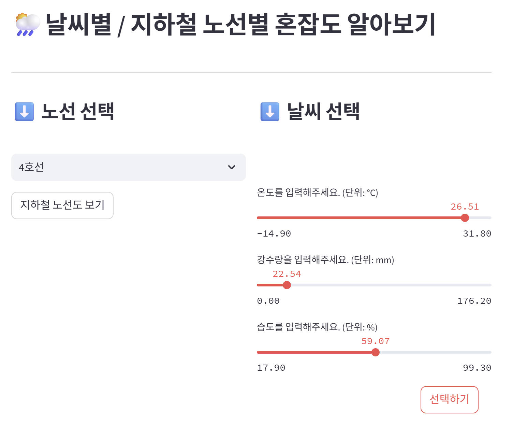
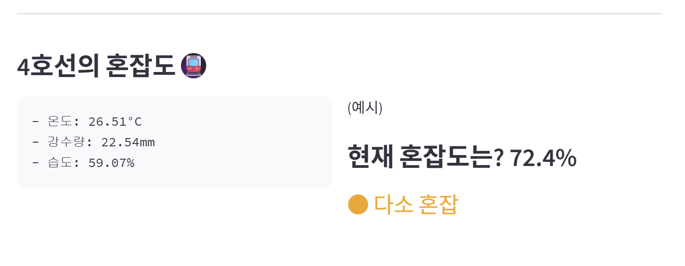

# SK네트윅스 Family AI 캠프 17기 ML Project MINI_5TEAM #

# 1. 팀 소개
### 👉 1.1 팀명 : 로켓단
로켓처럼 정상을 향해 날아오르겠다는 의미를 담았습니다! 
 
 

### 👉 1.2 팀원 소개 
|이름|사진|이름|사진|이름|사진|
|:---|---|:---|---|:---|---|
|[김태완](https://github.com/Kicangel)||[이재은](https://github.com/JAEEUN0129)||[임산별](https://github.com/ImMountainStar)||
|[양송이](https://github.com/songeeeey)||[전상아](https://github.com/sang-a-le)||

------
 
 

# 2. 프로젝트 개요

## 👉 2.1 프로젝트 명 
### 기상요인에 따른 서울시 지하철 호선별 혼잡도 예측 시스템 
- 기간 : 2025.07.26 ~ 2025.08.01
 

## 👉 2.2 프로젝트 필요성
### 2.2.1 프로젝트 배경
**(1) 혼잡도의 사회적 문제**  
- 국토교통부 조사에 따르면, 수도권 지하철은 **평일 출근 시간대 평균 혼잡도가 150%를 초과하는 구간이 다수 존재** *(서울연구원, 2023)*
- 지하철의 극심한 혼잡도는 시민들의 스트레스와  **재난·사고 시 대피 지연과 안전사고 증가로 이어짐**
 

#### **(2) 기상 조건이 대중교통 이용에 끼치는 영향**  
- 이용자들은 날씨 상황에 따라 대중교통 이용 패턴을 유연하게 바꾸는 모습을 보임

  

  출처: <a href="https://blog.naver.com/kma_131/220996892740">기상청 블로그</a> & 최상기(2021) *기상조건에 따른 대중교통 수요변화에 관한 연구*

 

- 기상 요인 (강수, 온도, 적설, 습도) 등은 대중교통 이용에 영향을 끼침
   
  
> **"강우량과 체감온도는 대중교통 수요 감소와 높은 상관관계를 보이며,  
> 특히 버스 이용률은 기상 악화 시 7% 이상 감소하는 것으로 나타났다."**  
> *(최상기 외, 2013)*
   
 

  

  출처: <a href="https://blog.naver.com/kma_131/220996892740">기상청 블로그</a> & 최상기(2021) *기상조건에 따른 대중교통 수요변화에 관한 연구(2013
    )*

 

 

**(3) 기존 대중교통 서비스의 한계**  
- 네이버 지도, 카카오 지도 등 주요 대중교통 안내 서비스의 한계  
  - 도착 시간/환승 횟수 등 **거리·시간 중심의 경로 추천만 제공**  
  - 기상 정보는 단순 기온 제공에 그쳐, **날씨 조건에 따른 혼잡도 변화 정보 부재**
     

  

   네이버 지도, 카카오 지도 서비스 화면 캡처

    

 
 

### 2.2.2 프로젝트 필요성
- 지하철 혼잡도는 **시민 안전과 직결되는 데이터**  
- **기상 요인을 반영한 예측 시스템이 현재 부재**  
- 이용자들은 날씨별 혼잡도 정보를 통해 **최적 이동 루트** 를 제공
**⇒ 혼잡도 + 기상 요인을 반영한 예측 시스템 구축 필요**

----

 
 

## 👉 2.3 프로젝트 목적
**(1) 기상 요인과 지하철 혼잡도 간 관계 분석**  
- 2019~2024년 서울시 지하철 **호선별 일별 승차 인구 데이터 기반 분석**  
- 강수량, 기온, 습도 등 기상 요소와 혼잡도의 정량적 관계 도출  
- 호선별·시간대별 혼잡도 변동 패턴 파악
   
  → **기상 조건별 혼잡도 예측 가능성 확보**
 

**(2) 지하철 혼잡도 예측 모델 개발**  
- 기상 데이터와 다년간 지하철 이용 데이터를 결합  
- **호선별 혼잡도 예측 모델 구축**  

 

**(3) 이용자 중심 서비스 기획**  
- 예측 모델 결과를 기반으로 지도 어플리케이션(네이버 지도, 카카오 지도 등)에 **날씨 조건을 반영한 맞춤형 최적 경로 추천 서비스** 기획  

 
 

-----
# 3. 기술 스택
|Python|Github|Pandas|Matplotlib|
|---|---|---|---|
|| |||

 
 

--------

 

# 👉 4. 데이터 

### 4.1 🚈 서울시 지하철 호선별 승하차 수 데이터 

| 항목            | 내용                                                                                                      |
|-----------------|-----------------------------------------------------------------------------------------------------------|
| **데이터명**     | 서울시 지하철 호선별 역별 승하차 인원정보                                                                 |
| **데이터 출처**   | [서울 열린데이터 광장](https://data.seoul.go.kr/dataList/OA-12914/S/1/datasetView.do)                     |
| **데이터 기간**   | 2019.01.01 ~ 2024.12.31                                                                                  |
| **데이터 크기**   | 약 70MB (70,467,662 바이트)                                                                               |
| **데이터 수집 방법** | API를 통한 수집                                                                                            |
| **데이터 제공기관** | 서울특별시 교통정책과                                                                                       |
| **데이터 형태**   | CSV 파일                                                                                                   |
| **데이터 설명**   | 서울시 지하철 각 역과 호선별 일자별 승하차 인원 현황을 제공하는 데이터셋                                   |
| **주요 칼럼**     | 사용일자, 호선명, 역명, 승차총객수, 하차총승객수, 등록일자                                                   |

 

### 🌦️ 4.2 기상 데이터 
| 항목              | 내용                                                                                                    |
|-------------------|---------------------------------------------------------------------------------------------------------|
| **데이터명**         | 서울시 기상데이터                                                                                       |
| **데이터 출처**       | [국가기후데이터센터](https://data.kma.go.kr/data/grnd/selectAsosRltmList.do?pgmNo=36)                   |
| **데이터 기간**        | 2019.01.01 ~ 2024.12.31                                                                                |
| **데이터 크기**         | 약 79KB                                                                                                |
| **데이터 수집 방법**     | API를 통한 수집                                                                                         |
| **데이터 제공기관**       | 국가기후데이터센터                                                                                      |
| **데이터 형태**          | CSV 파일                                                                                                  |
| **데이터 설명**          | 종관기상관측(ASOS) 데이터를 활용하여 서울시의 기상 정보를 제공하는 데이터셋                                |
| **주요 칼럼**             | 날짜, 강수량, 온도, 습도 *(필요한 칼럼만 수집)*                                                           |

 

### 😷 4.3 미세먼지 데이터 
| 항목              | 내용                                                                                                    |
|-------------------|---------------------------------------------------------------------------------------------------------|
| **데이터명**         | 서울시 미세먼지 데이터                                                                                       |
| **데이터 출처**       | [서울특별시 대기환경정보](https://cleanair.seoul.go.kr/statistics/dayAverage)   |
| **데이터 기간**        | 2019.01.01 ~ 2024.12.31                                                                                |
| **데이터 크기**         | 약 79KB                                                                                                |
| **데이터 수집 방법**     | 엑셀다운로드                                                                                         |
| **데이터 제공기관**       | 서울특별시 대기정책과                                                                                   |
| **데이터 형태**          | CSV 파일                                                                                                  |
| **데이터 설명**          | 서울특별시의 초미세먼지 PM-2.5 (㎍/m3) 데이터                           |
| **주요 칼럼**             | 날짜, 미세먼지                                                          |
 
 

-----
# 5. 전처리과정

**지하철 데이터, 기상 데이터, 미세먼지 데이터를 통합하여 모델링에 활용 최종 데이터셋 구축**

 

## 5.1 지하철 데이터 전처리
- **이상치 제거:**  
  - 일별 승차 인원 데이터에서 사분위수(IQR) 기반 **박스플롯(Boxplot)** 을 활용하여 이상치를 제거  

 

## 5.2 기상 데이터 전처리
- **결측치 처리:**  
  - 강수량, 적설량 등 결측값은 **0으로 채움**  
  - 실제 값이 없는 경우 강수나 적설이 없는 상태로 간주  

 

## 5.3 미세먼지 데이터 전처리
- **결측치 처리:**  
  - 미세먼지(PM2.5, PM10) 관련 변수의 결측값은 **중앙값(Median)** 으로 대체  
 

## 5.4 주말/공휴일 Flag 생성
 
    

    
     
날짜별 지하철 총 승하차 인원
       
=> 일정한 패턴에서 벗어난 이상치들이 존재함 
    
  - **flag 변수(`holiday_flag`) 구축:**  
    - `date` 컬럼을 기준으로 해당 날짜가 **주말(토/일) 또는 공휴일인 경우 1, 평일인 경우 0으로 설정**  
  - 공휴일 정보는 [`holidays`](https://pypi.org/project/holidayskr/) 라이브러리를 사용하여 판별  
  - 요일 편차를 제거하기 위한 분석 변수로 사용
 
 

## 5.5 데이터 통합
- **통합 기준:**  
  - `date`(날짜) 컬럼을 기준으로 세 데이터셋(지하철 + 기상 + 미세먼지)을 병합  
  - 최종적으로 **각 날짜별 지하철 승차 인원 + 기상 요인 + 미세먼지 데이터 + 주말/공휴일 flag**가 포함된 통합 데이터셋 구축  

 

## 5.6 최종 데이터 컬럼 설명
총 21,920개 행, 9개 칼럼으로 구성
| No. | 컬럼명               | Non-Null Count | 데이터 타입   | 설명                                  |
|-----|---------------------|----------------|--------------|--------------------------------------|
| 0   | `Unnamed: 0`        | 21,920         | int64        | 인덱스 컬럼 (데이터프레임 저장 시 생성) |
| 1   | `date`              | 21,920         | object       | 날짜 (YYYY.MM.DD)                     |
| 2   | `ride_count`        | 21,920         | float64      | 지하철 승차 인원                        |
| 3   | `AvgTemp(°C)`       | 21,920         | float64      | 평균 기온 (℃)                          |
| 4   | `Rainfall(mm)`      | 21,920         | float64      | 강수량 (mm)                            |
| 5   | `WindSpeed(m/s)`    | 21,920         | float64      | 풍속 (m/s)                             |
| 6   | `Humidity(%)`       | 21,920         | float64      | 평균 습도 (%)                          |
| 7   | `isolation(MJ/m2)`  | 21,920         | float64      | 일사량 (MJ/m²)                         |
| 8   | `holiday_flag`      | 21,920         | int64        | 공휴일 여부 (1=공휴일/주말, 0=평일)      |

 

## 5.7 최종 데이터셋 예시

| date     | ride_count | AvgTemp(째C) | Rainfall(mm) | WindSpeed(m/s) | Humidity(%) | isolation(MJ/m2) | holiday_flag |
|----------|------------|--------------|--------------|----------------|-------------|-------------------|---------------|
| 2019.1.1 | 39420      | -5           | 0            | 2.1            | 49.5        | 7.84              | 1             |
| 2019.1.1 | 11807      | -5           | 0            | 2.1            | 49.5        | 7.84              | 1             |
| 2019.1.1 | 20944      | -5           | 0            | 2.1            | 49.5        | 7.84              | 1             |
| 2019.1.1 | 17798      | -5           | 0            | 2.1            | 49.5        | 7.84              | 1             |

    

-----

 
 

# 6. 머신러닝 
## 6-1 사용한 모델

1. **선형 회귀**
2. **SVM**
3. **규제 선형 모델 (Ridge, Lasso)**
4. **Decision Tree**
5. **Random Forest**
6. **Ensemble (xgBoost, Light Boost)**

## 6-2 학습 성능 측정 결과

- train set에 대한 성능이 0.149.. ~= 15%로 모델이 데이터 셋을 잘 설명을 하지 못한다는 것을 의미한다
  
---

## 6-3 모델의 성능 향상을 위한 단계별 접근 

1. **초기 문제점 파악**
### 초기 특성값 : ride_count (탑승 인원), AvgTemp (평균 온도), Rainfall(강수량), Humidity(습도)
1) Linear Regression

- R2 score가 매우 낮음 (0.001)

2) SVR
 

- R2 score가 매우 낮음 (-0.09)
  
3) 규제 선형 모델
- Ridge
  
  

  R2 score가 매우 낮다 (0.004)

- Lasso
  
  

  R2 score가 매우 낮다 (0.004)

4) RandomForest
   
   

   R2 score 가 매우 낮다 (0.05)
   
6) GradientBoosting
- xgBoost
  
  

  R2 score 가 매우 낮다 (0.008)
  
- LightBoost
  
  

  R2 score가 매우 낮다 (0.07)

## 문제점 파악 : Target data의 정합성 확인
- 데이터 셋 자체의 문제 확인
- 타깃의 분산이 0에 가깝다면 모델이 설명할 게 없다
  

- 분산이 높기 때문에 Target dataset의 분포도 문제는 아니다

### 문제점 파악 : 전치리 문제 파악
- 결측치 / 이상치 처리 실수는 일어나지 않음
- 통계청 자료 기반이라 데이터 신뢰성도 높다

### 문제점 파악 : 하이퍼파라미터 문제
- 모든 모델 학습 시도에서 GridSearchCV 또는 RandomizedSearchCV를 이용
- 후보 하이퍼파라미터를 기입하는 과정에서 잘못된 후보 하이퍼파라미터가 기입될 수 있다는 가능성이 존재하지만, 감안해서라도 score 값이 매우 낮기 때문에 주요 원인이 아니라고 파악 

### 문제점 파악 : 상관 관계 파악

- Target Data(ride_count)와 다른 변수들과의 상관 계수가 0에 가깝다
- 즉, 특성과 Target Data 사이에 아무 상관관계가 없다
- 의심 : 특성이 데이터를 잘 설명하지 못해 학습이 일어나지 않는다
- 해결 시도 : 주말 데이터 추가 (기존에는 평일 데이터만 전처리) 

# 2. **주말 데이터 추가**
### Ridge 모델

  R2 score가 매우 낮다 (0.02) : 오히려 떨어짐 

### 문제점 파악 : 상관 관계 파악

-  Target Data(ride_count)와 다른 변수들과의 상관 계수가 0에 가깝다
- 아무 상관관계 없다
- 의심 : 특성이 데이터를 잘 설명하지 못해 학습이 일어나지 않는다
- 해결 시도 : 특성 추가 
  
# 3. **특성 추가 (3개 추가; 풍속,일사량,미세먼지)**
  1) Linear Regression
     

- R2 score가 100배 증가, 하지만 여전히 매우 낮음 (0.1)

2) SVR
   

- R2 score가 증가했지만, 하지만 여전히 매우 낮음 (-0.09) --> 0.01
  
3) 규제 선형 모델
- Ridge
  
  

  R2 score가 25배 증가, 하지만 여전히 매우 낮음 (0.1)

- Lasso
  
  

  R2 score가 25배 증가, 하지만 여전히 매우 낮음 (0.1))

4) RandomForest
   
   

   R2 score 가 약 4배 중가, 하지만 여전히 매우 낮다 (0.18)

   Testset에 대한 예측도 매우 낮다
   
6) GradientBoosting
   
   

- xgBoost

  R2 score가 매우 증가 했지만, 여전히 매우 낮다 (0.13)
  
- LightBoost
 
  R2 score가 매우 증가 했지만, 여전히 매우 낮다 (0.19)

### 문제점 파악 : 상관 관계 파악

- Target Data(ride_count)와 다른 변수들과의 상관 계수가 0에 가깝다
- 해결 시도 : 특성 추가
  
# 4. **8가지 특성 추가 (오존, 일산화탄소 등...)**
  1) Linear Regression
     

- R2 score 변화 없음, 여전히 매우 낮음 (0.1)

2) SVR
   

- R2 score가 약 5배 증가했지만, 하지만 여전히 매우 낮음 0.05
  
3) 규제 선형 모델
- Ridge
  
  

  R2 score 변화 없음, 여전히 매우 낮음 (0.1)

- Lasso
  
  

  R2 score 변화 없음, 여전히 매우 낮음 (0.1)

4) RandomForest
   
   

   R2 score 약간 증가, 여전히 매우 낮음 (0.2)

   Testset에 대한 예측도 매우 낮다

6) DecisionTree
   
   

   R2 score가 매우 낮음 (-2.9)
   
8) GradientBoosting
   

- xgBoost

  R2 score가 증가 했지만, 여전히 매우 낮다 (0.2)
  
- LightBoost

  R2 score가 증가 했지만, 여전히 매우 낮다 (0.2)

### 문제점 파악 : 상관 관계 파악

- Target Data(ride_count)와 다른 변수들과의 상관 계수가 0에 가깝다

### 문제점 파악 : 특성 중요도 파악 (DecisionTree)

- 모델이 feature 5에 과도하게 의존하면서 전체 성능을 깎는 방향으로 작동하고 있었다.
- 즉, feature_importances_에서 0.84로 엄청 높게 나왔지만, 그게 오히려 모델을 망치는 “해로운” 정보였다는 의미
  

- 그 특성을 제거하자 모델이 train 상에서는 더 잘 맞춰졌다.

### 문제점 파악 : 아주 작은 서브셋에서 과적합이 일어나는가 파악

- 여전히 R2 score값이 0.3으로 낮음
- 의심 : 데이터 / 타깃 사이에 유의미한 관계가 없거나 target data에 문제가 있다

### 문제점 파악 : Baseline 예측
- Baseline : 가장 단순한 예측
  
  

- 해당 DummyRegressor는 모든 입력에 대해 타깃의 평균만 예측하는 모델
- 베이스라인 R² = 0.0, 실제 모델 R² = 0.003
- 이는 실제 모델이 평균만 예측하는 것보다 아주 조금 나은 수준, 유의미한 설명력을 얻지 못하고 있다는 뜻
- 의심 : 입력 <--> 타깃 대응에 문제가 있다고 의심

### 향후 Project Develop을 위한 방향성 제시
1. **특성 추가 및 불필요한 특성 제거**
2. **Target Data 정교화**

 
 

# 7. 서비스 구현 | Streamlit 구현

 

  

  

### 🚧 구현하고자 한 주요 기능

1. **사용자 입력을 통한 혼잡도 조회**
    - 주요 선택 요소: 지하철역, 온도, 강수량, 습도
    - **사용자 입력을 단순화하기 위해**, 이 세 가지 주요 기상 요소를 중심으로 선정
    - 특정 조건을 선택하면, 학습된 모델이 해당 조건에 대한 **예측 승차 인원**을 기반으로 혼잡률(%)을 계산해 보여줌
2. **혼잡도 시각화**
    - 예측된 혼잡률을 기준으로 아래와 같이 시각화 예정:
        - 0~30% → 🟢 여유
        - 30~60% → 🟡 보통
        - 60~90% → 🟠 다소 혼잡
        - 90% 이상 → 🔴 매우 혼잡

 

---- 

# 8. 기대효과 
### **(1) 대중교통 운영 및 정책 측면**  
- 혼잡도 예측에 따른 **경찰·안전 인력 효율적 배치** 가능  
- 기상 악화 시 예상되는 혼잡 구간을 사전 식별 → **선제적 대응 가능**  
- 교통 병목 완화 및 **도시 전체 교통 효율성 향상**

   

### **(2) 이용자 서비스 측면**  
- 주요 시간대에 **날씨별 혼잡도 반영 최적 경로 추천 제공**  
- 지도 앱에서 `쾌적성(혼잡도)` + `효율성(소요시간)` 동시 고려한 루트 제안  
- 날씨 변화로 인한 이동 스트레스 감소 & **시민 만족도 향상**

 
 

-----

# 9. 한계점
 

- Y값(종속변수)이 프로젝트의 핵심 목표인 '혼잡도'를 100% 반영하지 못하는 지표여서, 독립변수와 종속변수 간의 상관관계가 매우 낮게 나타남.
- 주제에 적합한 데이터의 부재로 인해 프로젝트 완성도에 한계가 존재함.
- EDA 과정에서 전처리 방식을 조정하고 피처값을 증대시키는 작업을 진행했으며, 그 과정에서 '휴일 데이터 포함'과 '피처값 증대'가 성능 향상에 긍정적인 영향을 미침을 확인함.
- 현재 모델에서는 성능 향상이 미미한 수준이나, 추후 프로젝트를 발전시키는 과정에서 개선 방향을 제시하는 데 의미가 있음.

 

------

# 10. 회고록
| 이름              | 내용                                                                                                    |
|-------------------|---------------------------------------------------------------------------------------------------------|
| 김완태 | |
| 이재은 | |
| 임산별 | API를 통해 지하철 데이터를 수집하고, 데이터 전처리와 EDA, 상관분석, Ridge Regression을 진행했습니다. 모델 성능을 높이기 위해 데이터 형태를 다양하게 구성하고, 새로운 피처를 추가하는 등 여러 시도를 해보았습니다. 이 과정에서 모델 성능을 향상시킬 수 있는 다양한 대안을 고민하며, 회귀 분석 예측 모델의 전체 프로세스를 이해할 수 있었습니다. 또한 데이터 구성 방식에 따른 머신러닝 모델의 특성과 결과 차이를 체감했고, 데이터 전처리와 EDA를 통한 사전 검증의 중요성을 깊이 배우는 계기가 되었습니다. |
| 양송이 | 이번 머신러닝 미니 프로젝트에서 기상 데이터 수집 및 전처리와 랜덤포레스트, LGBM 회귀 모델 설계, streamlit 대시보드 기획을 맡으면서 데이터 구축부터 최종 모델링까지의 전 과정을 경험했습니다. 모델 성능 향상을 위해 다양한 모델을 비교·분석하고, 데이터를 추가하며 개선하는데 중점을 두다 보니, 최종적으로 페이지 구현까지는 어려웠다는 아쉬움이 남습니다. 그러나 머신러닝 모델을 단순히 학습 시키는 것 보다 데이터 피처를 어떻게 선택하느냐가 성능에 있어서 가장 중요하다고 느꼈습니다. 따라서 피처 엔지니어링과 시각화 및 EDA 설계에 더 집중하는 전략도 효과적인 방법이라는 것을 배웠습니다. |
| 전상아 | 이번 프로젝트에서 선형계수를 이용한 EDA 확인, 규제선형모델과 XGBOOST를 이용한 머신러닝 등을 시행했습니다. 머신러닝 진행 시, 모델 성능 평가 점수가 유효하게 나오지 않아 전처리 방식을 조정해 데이터 양을 늘리거나 변수를 늘리는 등의 노력을 했으나 원하는 방향으로 결과값이 나오지 않아 아쉬움이 많이 남습니다. 하지만, 이 프로젝트를 통해 머신러닝을 정제되지 않은 실제 데이터에 사용을 하면서 머신러닝의 작동 방식, 순서에 대해 더 잘 이해할 수 있었고, 팀원과의 소통 및 인사이트를 도출할 수 있는 프로젝트 주제를 선정하는 것이 중요하다는 것을 느꼈습니다. 더 나아가 목적에 맞는 데이터 선정이 프로젝트에 주는 영향에 대해 생각하게 되었고, 프로젝트 설계 방향에 대해 생각하는 계기가 되었습니다.|

